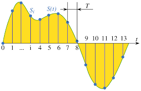

# Web Audio Analyzer

- breaking the music or audio into chunks and using the underlying data or binary bytes to process to make the waveform of that audio (in graphical form, the audio data is represented as a waveform)
- using the Web Audio API to analyze and visualize audio data in real-time
- AudioContext, AnalyserNode, ScriptProcessorNode
- Audio Nodes
- processing audio data in real-time into samples or frames
- sampling rate, frequency domain, time domain
- effective size, byte length, sample rate

### AudioContext

- The AudioContext interface represents an audio-processing graph built from audio modules linked together, each represented by an AudioNode.
- It is the main entry point for using the Web Audio API.

  - Create an AudioContext instance (audio file, microphone input, etc.)
  - Create audio nodes (e.g., AnalyserNode, GainNode, OscillatorNode)
  - Connect the nodes together
  - Start the audio processing

- flow of audio processing: `AudioSource` -> `AudioEffects` -> `AudioDestination`

  - `AudioSource`: Represents the source of audio data (e.g., audio file, microphone input, oscillator, camera input)
  - `AudioEffects`: Represents audio processing effects (e.g., gain, filter, delay, volume, compressor)
  - `AudioDestination`: Represents the final output of the audio processing (e.g., speakers, headphones)

- nodes in AudioSource:

  - `MediaElementAudioSourceNode`: Represents an audio source from a media element (e.g., `<audio>`, `<video>`).
  - `MediaStreamAudioSourceNode`: Represents an audio source from a media stream (e.g., microphone input, webRTC, camera input).
  - `AudioBufferSourceNode`: Represents an audio source from an `AudioBuffer` (e.g., audio file loaded into memory).

- Nodes in AudioEffects:

  - `GainNode`: Represents a gain (volume) control.
  - `AnalyserNode`: Represents an audio analyzer for visualizing audio data.
  - `FilterNode`: Represents a filter for processing audio frequencies.
    - `BiquadFilterNode`: A specific type of FilterNode that allows for various filter types (e.g., low-pass, high-pass, band-pass).
  - `BiquadFilterNode`: Represents a biquad filter (e.g., low-pass, high-pass, band-pass).
  - `DelayNode`: Represents a delay effect.
  - `DynamicsCompressorNode`: Represents a dynamics compressor.

- Nodes in AudioDestination:

  - `AudioDestinationNode`: Represents the final output of the audio processing (e.g., speakers, headphones).
  - `MediaStreamAudioDestinationNode`: Represents a destination for audio data that can be used in a media stream (e.g., webRTC).

- In order to process audioContext, we need samples or frames of audio data.

### Audio Samples and Frames

- Waveforms are continuous representations of audio signals, while samples are discrete points in time that represent the audio signal at specific intervals.

- Continuous waveforms (SIGNALS) need to be digitized into discrete samples for processing in digital audio systems.

- `Sampling` is the process of converting a continuous waveform into discrete samples by measuring the amplitude of the waveform at regular intervals (at regular or certain time intervals, sampling records the amplitude of the signal at those intervals).

- more data points (samples) mean more accurate representation of the waveform, but also more data to process.

### Sampling Rate

- The `sampling rate` (or sample rate) is the number of samples or signals taken per second when digitizing a continuous waveform.
- It is measured in Hertz (Hz) and determines the frequency range that can be accurately represented.
- A higher sampling rate allows for a wider frequency range and more accurate representation of the original waveform, but also requires more processing power and storage space.
- Common sampling rates include 44.1 kHz (CD quality), 48 kHz (professional audio), and 96 kHz (high-resolution audio).

### FFT (Fast Fourier Transform)

- The `Fast Fourier Transform (FFT)` is an algorithm that converts a time-domain signal into its frequency-domain representation.
- It is used to analyze the frequency content of audio signals and is a key component of audio analysis and visualization.
- The FFT algorithm efficiently computes the discrete Fourier transform (DFT) of a sequence, allowing for real-time analysis of audio signals.
- The FFT takes a time-domain signal (e.g., audio samples) and transforms it into a frequency-domain representation, showing the amplitude of different frequencies present in the signal.
- The output of the FFT is a complex number for each frequency bin, representing the amplitude and phase of that frequency in the original signal.
- The frequency bins are evenly spaced and cover the entire frequency range of the signal, with the number of bins determined by the size of the input signal.
- The FFT is commonly used in audio analysis applications, such as audio visualization, pitch detection, and audio effects processing.
- `The FFT size is the number of samples used for the Fast Fourier Transform, which determines the frequency resolution`.

### requestAnimationFrame

- requestAnimationFrame is a method that tells the browser to perform an animation and calls the specified function before the next repaint
- This is more efficient than using setInterval or setTimeout
- It allows the browser to optimize the animation and ensures that it runs at the best possible frame rate
